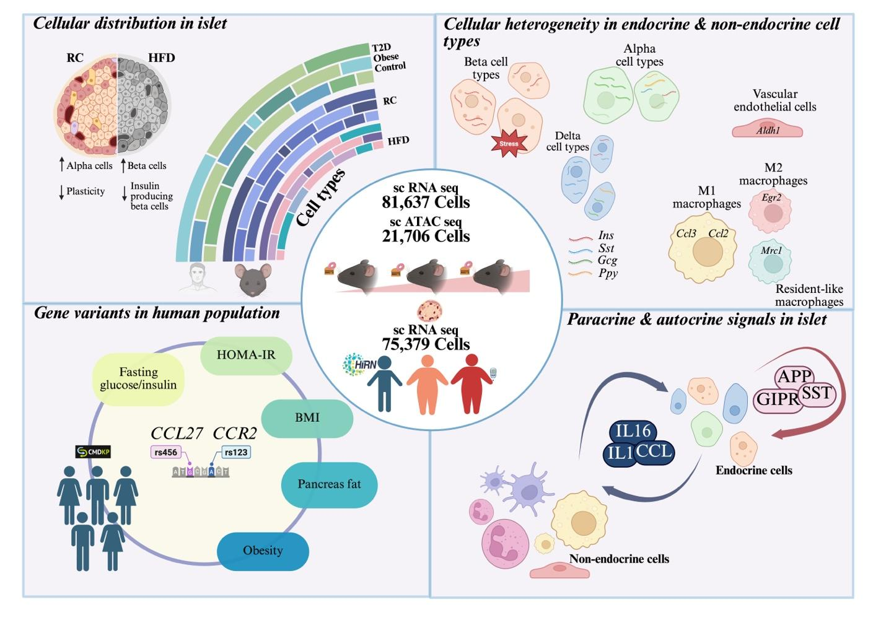

# Temporal Dynamics of Cellular Heterogeneity and Communication in Murine Pancreatic Islets under Euglycemic and Hyperglycemic States
Pancreatic islets undergo coordinated cellular remodeling during obesity-induced insulin resistance (IR). However, the associated molecular changes across endocrine and non-endocrine compartments remain largely unexplored. Here, using longitudinal single-cell RNA sequencing (scRNA-seq) and single-cell ATAC-seq on islets from C57BL/6 mice subjected to high-fat diet (HFD) feeding for 8, 16, and 24 weeks, along with age-matched controls, we mapped dynamic changes in islet cell composition and transcriptional states. Also integrated with human islet datasets from obese and T2D donors for further validations. This study presents a comprehensive high-resolution atlas of islet remodeling under metabolic stress, identifying key communication nodes and transcriptional programs pertinent to T2D pathogenesis.

    

## Contact
Sai Prasad Pydi, PhD (pydi@iitk.ac.in)
Hamim Zafar, PhD (hamim@iitk.ac.in)
Jürgen Wess, PhD (jurgenw@niddk.nih.gov)